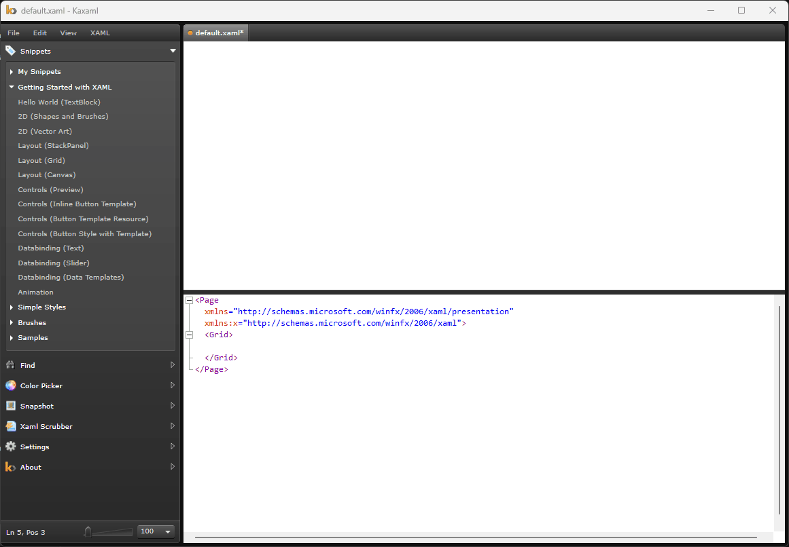

# Welcome to Kaxaml!

Kaxaml is a lightweight XAML editor that gives you a "split view" so you can see both your XAML and your rendered content (kind of like XamlPad but without the gigabyte of SDK). Kaxaml is a hobby and was created to be shared, so it's free!

Kaxaml is designed to be "notepad for XAML." It's supposed to be simple and lightweight and make it easy to just try something out. It also has some basic support for intellisense and some fun plugins (including one for snippets, one for cleaning up your XAML and for rendering your XAML to an image).

# This Fork

|  | 
|:--:|
| *Tag Edit Auto Matching Feature added in this Fork* |

|  | 
|:--:|
| *Referencing External Assembly DLLs* |

The big movtivation for this fork was the fact that the orginal project has been quiet for so many years.  I did not want to see if wither away as it is such a fantastic application - kudos to the  devs who put all of that effort into it.

First thing I did was upgrade to .NET 9.  While at it, I took the liberty of performing significant code cleanup and modernization.  I also fixed several annoying little bugs and added features I have always wished for.  No real roadmap to speak of, just fixing and adding things as they come up.

Note that this no longer supports Silverlight so if that is something you need, stick with the original.

I welcome any feedback.

# Changelog

## 9.4.0 - External Assembly References
- Provides the ability to load an external Assemblies
- Inspired by punker76's fork of Kaxaml ([Punker76 Fork](https://github.com/punker76/kaxaml))
- Allows DLLs to be loaded and referenced in XAML
- Ref can be saved with XAML using XML comment so they will be loaded automatically whenever XAML file is opened
- Other Changes
    - Change plugins to load via Dependency Injection
    - Add busy indicator when parse timer is in flight
    - Remove Font Chooser plugin empty stub
    - Snippet dialog editor single window instance
    - Update nuget packages
- Fixes
    - Fix memory leak with `WpfDocumentView` animation
    - Hide close buttons on Snippet and Xaml Dialog
    - Fix namespace for certain plugins
    - Fix snippet dialog editor memory leak
    - Reduce `WpfDocumentView` memory leak (to revisit)

## 9.3.3 - Fix another new document bug and more code cleanup
- Fixed another temp folder exception when launched from start menu
- Addressed TODO to remove p-invoke to get starting folder path
- Addressed TODO to eliminate non-type-safe equals in xml parser

## 9.3.2 – Tab UX Refinement
- Added `CTRL+F4` as an alternative to `CTRL+W` for closing tabs
- Changed close confirmation dialog from **Yes/No** to **OK/Cancel**

## 9.3.1 – Temp Storage & Stability
- Fixed UI exception when launching from Start Menu and creating a new document
- Added button in **About** screen to open `%LocalAppData%` folder
- Updated YAML config to run unit tests

## 9.3.0 – Smart XAML Editing
- Auto-matching of open/close tag names during XAML edits
  - Skips self-closing tags
  - Triggers only when exactly one unmatched tag
  - Supports undo and redo
- Added UI checkbox to toggle auto-matching feature
- Removed nullable marker from `TextEditor` (was redundant)
- Introduced `.editorconfig` for XAML formatting
- Added `Kaxaml.Tests` project
- Added “Star Trek” snippet
- Bound `CTRL+SPACE` to activate code completion window

## 9.2.1 – Namespace Cleanup & Logging
- Added button in **About** screen to open log folder
- Added logging to `WpfDocumentView`
- Refactored all `.cs` file namespaces to file-scoped
- Removed unused project property files
- Enabled `AssemblyInfo` generation in `.csproj` for files with `generic.xaml`
- Added prompt to confirm unsaved changes when closing the app

## 9.2.0 – File Logging Infrastructure
- Integrated `NLog` via dependency injection
- Logs written to `%LocalAppData%\Kaxaml\kaxaml.log`
- Addressed plugin load exception from `.csproj` script
- Added basic logging to main window and color picker

## 9.1.0 – Nullable Awareness & Cleanup
- Enabled nullable reference types across the project
- Performed code cleanup and adopted modern C# features
- Configured project to treat all warnings as errors
- Fixed plugin namespace issues
- Fixed out-of-index error in find-replace when using “Select All”
- Updated **About** screen to reflect assembly version

## 9.0.0 – .NET 9 Migration
- Upgraded to .NET 9 and resolved breaking changes
- Removed Silverlight plugin
- Removed installer project
- Removed unused NuGet packages
- Updated to latest NuGet packages
- Fixed miscellaneous exceptions and binding errors
